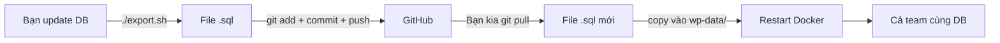

# 🛒 WordPress E-Commerce — Docker + GitHub Collaboration

> **Dành cho team:** Linux (bạn) + Windows (bạn của bạn) làm việc nhóm qua GitHub

---

## 📦 Công nghệ sử dụng

| Service | Image | Mục đích |
|---------|-------|----------|
| **WordPress** | `wordpress:latest` | CMS + E-Commerce |
| **MySQL** | `mysql:latest` | Database |
| **phpMyAdmin** | `phpmyadmin:latest` | Quản lý DB qua web |
| **WP-CLI** | `wordpress:cli` | Quản lý WordPress bằng command |

---

## 🚀 Cài đặt ban đầu

### 1. Yêu cầu

| Bạn (Linux) | Bạn của bạn (Windows) |
|-------------|----------------------|
| Docker Engine + Docker Compose | [Docker Desktop for Windows](https://docs.docker.com/desktop/setup/install/windows-install/) |
| Git | [Git for Windows](https://git-scm.com/download/win) (có **Git Bash**) |
| Thêm user vào group docker: `sudo usermod -aG docker $USER` | Cài WSL2 (Docker Desktop tự động xài) |

> 💡 **Git Bash** trên Windows cho phép chạy script `.sh` (như `export.sh`) y hệt Linux.

### 2. Clone repo về máy

```bash
# Cả Linux và Windows (Git Bash) đều dùng lệnh giống nhau
git clone https://github.com/<your-org>/<repo-name>.git
cd <repo-name>
```

### 3. Tạo file `.env`

```bash
# Trên Linux / macOS / Git Bash:
cp env.example .env

# Trên Windows CMD:
copy env.example .env
```

Chỉnh sửa file `.env` nếu cần:
```env
IP=127.0.0.1
PORT=80
DB_ROOT_PASSWORD=password
DB_NAME=wordpress
```

### 4. Khởi động Docker

```bash
# Lần đầu chạy (có thể mất vài phút để tải images):
docker compose up -d

# Kiểm tra trạng thái:
docker compose ps
```

### 5. Truy cập

| Ứng dụng | URL |
|-----------|-----|
| 🌐 **WordPress** | http://127.0.0.1:80 (hoặc PORT bạn đặt) |
| 🗄️ **phpMyAdmin** | http://127.0.0.1:8080 (user: `root`, pass: trong `.env`) |

---

## 🤝 Quy trình làm việc nhóm (GitHub Flow)

### Cấu trúc Git

```
main              ← nhánh chính, luôn ổn định
  └─ develop      ← nhánh phát triển chính
       ├─ feature/theme-*       ← làm theme
       ├─ feature/plugin-*      ← làm plugin/tính năng
       ├─ feature/db-*          ← thay đổi database
       └─ hotfix/*              ← sửa lỗi gấp
```

### Luồng làm việc hằng ngày

```bash
# 1. Luôn bắt đầu bằng việc cập nhật code mới nhất
git checkout develop
git pull origin develop

# 2. Tạo nhánh riêng cho việc mình làm
git checkout -b feature/ten-tinh-nang

# 3. Sau khi code xong, commit & push
git add .
git commit -m "Mô tả ngắn gọn việc đã làm"
git push origin feature/ten-tinh-nang

# 4. Lên GitHub tạo Pull Request (PR) vào nhánh develop
```

> ⚠️ **QUAN TRỌNG:** Không bao giờ commit file `.env` và thư mục `uploads/`!

---

## 🗄️ Database Migration — Chia sẻ DB giữa các thành viên

Đây là phần **dễ sai nhất** khi làm nhóm, hãy làm theo quy trình sau:

### 🔄 Quy trình đồng bộ Database



### Bước 1: Export DB (người có dữ liệu mới)

```bash
# Trên Linux hoặc Git Bash (Windows):
chmod +x export.sh
./export.sh
```

File `.sql` sẽ được tạo trong thư mục `wp-data/`.

### Bước 2: Commit file SQL lên Git

```bash
git add wp-data/
git commit -m "db: cập nhật database ngày XYZ"
git push
```

### Bước 3: Import DB (người kia)

```bash
# Kéo file SQL mới về
git pull origin develop

# Đặt file .sql vào wp-data/, restart container
docker compose down
docker compose up -d
```

> MySQL container sẽ **tự động import** file `.sql` từ `wp-data/` khi khởi động lần đầu.
> Nếu DB đã tồn tại, import thủ công:
> ```bash
> docker compose exec -T db sh -c 'exec mysql -uroot -p"$MYSQL_ROOT_PASSWORD" "$MYSQL_DATABASE"' < wp-data/ten_file.sql
> ```

---

## 🔧 Các lệnh thường dùng

### Docker Compose

| Lệnh | Mô tả |
|------|-------|
| `docker compose up -d` | Khởi động containers (nền) |
| `docker compose down` | Dừng và xoá containers |
| `docker compose down -v` | Xoá luôn database volume (⚠️ mất DB local) |
| `docker compose start` | Bắt đầu containers đã có |
| `docker compose stop` | Tạm dừng containers |
| `docker compose restart` | Khởi động lại |
| `docker compose ps` | Xem trạng thái |
| `docker compose logs -f` | Xem log (nhấn Ctrl+C để thoát) |

### WP-CLI (Quản lý WordPress)

```bash
# Cài plugin
docker compose run --rm wpcli plugin install woocommerce --activate

# Cài theme
docker compose run --rm wpcli theme install storefront --activate

# Danh sách plugin
docker compose run --rm wpcli plugin list

# Tạo user admin mới
docker compose run --rm wpcli user create admin2 admin2@example.com --role=administrator --user_pass=password
```

> 💡 **Mẹo**: Thêm alias để gõ nhanh hơn:
> ```bash
> alias wp="docker compose run --rm wpcli"
> ```
> Sau đó chỉ cần gõ: `wp plugin list`

---

## 🧩 Phân chia công việc — E-Commerce Team

Khi làm trang **thương mại điện tử** với WordPress + WooCommerce, team có thể chia như sau:

### 👤 Thành viên A (Front-end / Theme)
**Công việc:**
- Code theme con (child theme) trong `wp-app/wp-content/themes/`
- Tuỳ chỉnh giao diện, CSS, template
- Cài Storefront hoặc theme thương mại điện tử

**Làm việc:**
```bash
# Code trực tiếp trong thư mục themes/
code wp-app/wp-content/themes/
```

### 👤 Thành viên B (Plugin / Tính năng)
**Công việc:**
- Phát triển/tuỳ chỉnh plugin
- WooCommerce customization (giỏ hàng, thanh toán, shipping)
- API integrations

**Làm việc:**
```bash
# Mỗi plugin là một thư mục riêng trong plugins/
code wp-app/wp-content/plugins/
```

### 👤 Thành viên C (DB / Nội dung / Admin)
**Công việc:**
- Quản lý database migrations
- Thêm sản phẩm mẫu, danh mục
- Cấu hình WooCommerce settings
- Quản lý phpMyAdmin

**Làm việc:**
```bash
# Export DB sau khi thay đổi
./export.sh
git add wp-data/
git commit -m "db: cập nhật sản phẩm mẫu"
```

### 📋 Gợi ý kế hoạch phát triển E-Commerce

| Tuần | Việc | Người phụ trách |
|------|------|----------------|
| 1 | Cài WooCommerce, tạo sản phẩm mẫu | Admin |
| 1 | Chọn & tùy chỉnh theme | Front-end |
| 2 | Cấu hình giỏ hàng, thanh toán | Plugin dev |
| 2 | Tùy chỉnh giao diện sản phẩm | Front-end |
| 3 | Shipping methods, taxes | Plugin dev |
| 3 | Tối ưu mobile, responsive | Front-end |
| 4 | Testing, sửa lỗi | Cả team |

---

## 🪟 Lưu ý riêng cho Windows

| Vấn đề | Giải pháp |
|--------|-----------|
| **Chạy `.sh` script** | Dùng **Git Bash** thay vì CMD/PowerShell |
| **Port 80 bị chiếm** | Đổi `PORT=8080` trong `.env`, truy cập http://127.0.0.1:8080 |
| **File permissions** | File trong container có thể bị permission denied. Chạy: `docker compose exec wp chown -R www-data:www-data /var/www/html/wp-content/` |
| **Docker chậm** | Docker Desktop trên Windows chậm hơn Linux. Kiên nhẫn lần đầu. |
| **CRLF -> LF** | File `.gitattributes` đã cấu hình sẵn, Git tự động chuyển đổi |

---

## ⚠️ Troubleshooting — Các lỗi thường gặp & cách sửa

### 🔴 Lỗi 1: `wpcli-1 exited with code 1` — WP-CLI thoát giữa chừng

**Log điển hình:**
```
wpcli-1  | Error: Error establishing a database connection.
wpcli-1 exited with code 1
```

**Nguyên nhân**: **Race Condition**. Timeline thực tế:
```
T+0s   wpcli container created  →  chạy ngay lập tức
T+0s   db container created     →  bắt đầu init MySQL
T+1s   wpcli cố kết nối DB      →  ❌ MySQL chưa sẵn sàng!
T+8s   MySQL ready for connections →  ✅ nhưng wpcli đã exit rồi
```

`depends_on` chỉ đợi container **started**, không đợi MySQL **sẵn sàng nhận kết nối** (port 3306 mở ≠ MySQL đã initialized).

**Đã fix trong `docker-compose.yml`**:
- `wpcli` đã thêm `profiles: [cli]` → **không** chạy tự động nữa, chỉ chạy khi bạn gọi thủ công
- `db` đã thêm `healthcheck` → các service khác đợi DB thực sự sẵn sàng
- `wp` và `pma` dùng `depends_on db condition: service_healthy`

### 🔴 Lỗi 2: Không đăng nhập được phpMyAdmin — Access denied (1045)

**Log điển hình:**
```
mysqli::real_connect(): (HY000/1045): Access denied for user 'admin'@'172.19.0.4' (using password: YES)
```

**Nguyên nhân**: Bạn đang đăng nhập với username **`admin`**.

MySQL chỉ có 1 user duy nhất: **`root`** (do `docker-compose.yml` khai báo `MYSQL_ROOT_PASSWORD`). Không có user `admin` nào tồn tại!

**Cách sửa**: Vào trang phpMyAdmin, điền chính xác:

| Trường | Giá trị đúng |
|--------|-------------|
| 👤 Username | **`root`** |
| 🔑 Password | **`password`** (hoặc giá trị `DB_ROOT_PASSWORD` trong `.env`) |
| 🖥️ Server | `db` (giữ nguyên) |

> 💡 **Mẹo nhớ**: MySQL root user giống như `root` trong Linux — luôn là `root`, không phải `admin`.

### 🔴 Lỗi 3: "port is already allocated"
→ Port 80 đã có app khác dùng. Sửa `PORT` trong `.env` thành `8080` hoặc `3000`.

### 🔴 Lỗi 4: Permission denied khi upload media
```bash
docker compose exec wp chown -R www-data:www-data /var/www/html/wp-content/uploads/
```

### 🔴 Lỗi 5: WordPress hỏi FTP khi cài plugin/theme
→ Thêm dòng này vào `wp-app/wp-config.php` (trước `/* That's all, stop editing! */`):
```php
define('FS_METHOD', 'direct');
```

### 🔴 Lỗi 6: Quên mật khẩu admin WordPress
```bash
docker compose run --rm wpcli user update admin --user_pass=newpassword
```

### 🔴 Lỗi 7: WordPress load chậm sau khi restart container
→ WordPress cache DNS của DB container. Restart thêm WP:
```bash
docker compose restart wp
```

---

## 🗄️ Database Migration — 3 Cấp Độ (Cơ Bản → Nâng Cao)

### 📗 Cấp 1: Manual SQL Export/Import (đơn giản nhất)

**Khi nào dùng**: Team nhỏ (2-3 người), thay đổi DB không thường xuyên.


**Bước 1 — Export (Người có thay đổi):**
```bash
./export.sh
# Tạo ra file: wp-data/export_2026-06-30_10-30-00.sql
```

**Bước 2 — Commit & Push:**
```bash
git add wp-data/export_*.sql
git commit -m "db: thêm sản phẩm mẫu, cấu hình WooCommerce"
git push origin develop
```

**Bước 3 — Import (Người còn lại):**
```bash
git pull origin develop

# Nếu DB chưa có gì (lần đầu):
docker compose down   # xoá container
docker compose up -d  # MySQL sẽ tự import file .sql trong wp-data/

# Nếu DB đã có dữ liệu cũ → import thủ công:
docker compose exec -T db mysql -uroot -p"$DB_ROOT_PASSWORD" "$DB_NAME" < wp-data/export_2026-06-30_10-30-00.sql
```

> ⚠️ **Lưu ý**: Cách này **ghi đè toàn bộ** DB. Chỉ dùng khi cả team đồng ý "sync toàn bộ".

---

### 📘 Cấp 2: WP-CLI Partial Export (chỉ export content)

**Khi nào dùng**: Muốn chia sẻ nội dung (posts, products, users) nhưng giữ nguyên cấu trúc DB mỗi người.

```bash
# Export chỉ nội dung quan trọng
TABLES="wp_posts wp_postmeta wp_users wp_usermeta wp_terms wp_term_taxonomy wp_term_relationships wp_options"
docker compose run --rm wpcli db export - --tables=$TABLES | gzip > wp-data/content_$(date +%Y%m%d).sql.gz

# Import nội dung (người kia)
gunzip -c wp-data/content_20260630.sql.gz | docker compose exec -T db mysql -uroot -p"$DB_ROOT_PASSWORD" "$DB_NAME"
```

**Ưu điểm**: Không ghi đè cấu hình cá nhân (site URL, active theme).  
**Nhược điểm**: Phải liệt kê bảng thủ công.

---

### 📙 Cấp 3: WP Migrate DB PRO (chuyên nghiệp nhất)

**Khi nào dùng**: Team ≥ 3 người, migrate DB thường xuyên, cần push/pull DB qua GUI.

**Công cụ**: [WP Migrate DB PRO](https://deliciousbrains.com/wp-migrate-db-pro/) (trả phí, ~$99/năm)

```bash
# Cài plugin (sau khi mua license)
docker compose run --rm wpcli plugin install wp-migrate-db-pro --activate

# Hoặc dùng bản miễn phí (ít tính năng hơn):
docker compose run --rm wpcli plugin install wp-migrate-db --activate
```

**Tính năng chính:**
| Tính năng | Mô tả |
|-----------|-------|
| **Push/Pull** | Kéo/đẩy DB giữa các máy trong team qua WordPress admin |
| **Find & Replace** | Tự động thay URL localhost → production khi migrate |
| **Media Files** | Pull media files kèm theo DB |
| **Selective Sync** | Chỉ migrate 1 số bảng nhất định |
| **CLI Support** | Tự động hoá qua WP-CLI |

**Workflow với WP Migrate DB PRO:**
```
Bạn (Linux)                     Bạn kia (Windows)
    │                                │
    ├─ Sửa sản phẩm, setting        ├─ Sửa theme, CSS
    │  (thay đổi DB)                │  (thay đổi code)
    │                                │
    ├─ WP Admin → Migrate DB PRO    │
    │  → Push DB lên GitHub Gist    │
    │                                │
    │                                ├─ WP Admin → Migrate DB PRO
    │                                │  → Pull DB từ Gist về máy
    │                                │
    └──── Cả 2 cùng DB mới nhất ────┘
```

---

### 📊 So sánh 3 cách

| Tiêu chí | Manual SQL | WP-CLI Partial | WP Migrate DB PRO |
|----------|-----------|----------------|-------------------|
| **Chi phí** | Miễn phí | Miễn phí | ~$99/năm |
| **Độ khó** | ⭐ Dễ | ⭐⭐ Trung bình | ⭐⭐⭐ Cần học |
| **Ghi đè DB** | Toàn bộ | Chọn bảng | Chọn bảng |
| **Find & Replace URL** | Thủ công | Thủ công | Tự động |
| **Pull media** | Không | Không | Có |
| **Phù hợp team** | 2-3 người | 2-3 người | 3+ người |

> 💡 **Khuyến nghị**: Bắt đầu với **Cấp 1** (manual SQL). Khi team lớn hơn, nâng lên Cấp 3.

---

## 🚨 Giảm Thiểu Conflict Khi Làm Việc Nhóm

### 1. 📁 Phân vùng file rõ ràng (giảm 90% conflict)

```
wp-app/wp-content/
├── themes/
│   └── my-ecommerce/         ← ✅ Người A code (KHÔNG ai khác đụng)
├── plugins/
│   ├── my-custom-payment/    ← ✅ Người B code
│   └── my-shipping/          ← ✅ Người C code
└── uploads/                  ← 🚫 KHÔNG ai commit (đã trong .gitignore)
```

**Quy tắc vàng**: Mỗi người chỉ code trong file của mình, KHÔNG sửa file của người khác.

### 2. 🗄️ DB — Một người làm chủ

Chỉ định **1 người** làm "DB Master". Người này:
- Là người duy nhất export DB
- Là người duy nhất commit file `.sql`
- Những người khác chỉ import, không export

→ Tránh conflict trên file `.sql` (SQL rất khó merge dòng).

### 3. 🔀 Git workflow hằng ngày

```bash
# Mỗi sáng — bắt đầu ngày mới
git checkout develop
git pull origin develop
docker compose up -d   # đảm bảo containers chạy

# Trong ngày — làm việc trên nhánh riêng
git checkout -b feature/ten-tinh-nang
# ... code ...
git add wp-app/wp-content/themes/my-ecommerce/  # ← CHỈ add file của mình
git commit -m "theme: tuỳ chỉnh trang sản phẩm"

# Cuối ngày — push lên GitHub
git push origin feature/ten-tinh-nang
# → Tạo Pull Request trên GitHub
```

### 4. 📋 Checklist trước khi merge

- [ ] Đã `git pull origin develop` về nhánh của mình?
- [ ] Đã test `docker compose up` vẫn chạy OK?
- [ ] Đã check không commit file `.env`, `uploads/`, `debug.log`?
- [ ] Đã báo cho team biết mình sắp merge?

### 5. 🛠️ Cách xử lý khi conflict xảy ra

```bash
# Conflict trên code PHP/CSS/JS
# → Mở file bị conflict, tìm dấu <<<<<<< ======= >>>>>>>
# → Chọn giữ lại code nào, xoá code nào
# → Git add + commit

# Conflict trên file SQL
# → KHÔNG merge thủ công!
# → Chọn 1 phiên bản: git checkout --theirs wp-data/export_*.sql
# → Hoặc: git checkout --ours wp-data/export_*.sql
# → DB Master sẽ export lại bản mới nhất sau khi merge
```

### 6. 💬 Giao tiếp team

| Kênh | Mục đích |
|------|----------|
| **GitHub Issues** | Bug report, feature request |
| **Pull Request comments** | Review code |
| **Discord/Slack/Zalo** | Trao đổi nhanh: "T đang sửa file X, đừng đụng vào" |

---

## 📚 Kiến thức cần biết thêm

- [Docker Documentation](https://docs.docker.com/)
- [WordPress Developer Handbook](https://developer.wordpress.org/)
- [WooCommerce Developer Docs](https://woocommerce.com/document/woocommerce-developer-documentation/)
- [GitHub Flow Guide](https://docs.github.com/en/get-started/using-github/github-flow)
- [WP Migrate DB PRO](https://deliciousbrains.com/wp-migrate-db-pro/)
- [WP-CLI Commands](https://developer.wordpress.org/cli/commands/)
