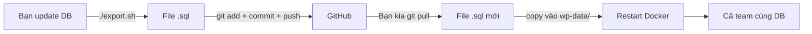

# 🛒 WordPress E-Commerce — Docker + GitHub Collaboration

> **Dành cho team:** Linux (bạn) + Windows (bạn của bạn) làm việc nhóm qua GitHub

---

## 📦 Công nghệ sử dụng

| Service | Image | Mục đích |
|---------|-------|----------|
| **WordPress** | `wordpress:latest` | CMS + E-Commerce |
| **MySQL** | `mysql:latest` | Database |
| **phpMyAdmin** | `phpmyadmin:latest` | Quản lý DB qua web |
| **WP-CLI** | `wordpress:cli` | Quản lý WordPress bằng command |

---

## 🚀 Cài đặt ban đầu

### 1. Yêu cầu

| Bạn (Linux) | Bạn của bạn (Windows) |
|-------------|----------------------|
| Docker Engine + Docker Compose | [Docker Desktop for Windows](https://docs.docker.com/desktop/setup/install/windows-install/) |
| Git | [Git for Windows](https://git-scm.com/download/win) (có **Git Bash**) |
| Thêm user vào group docker: `sudo usermod -aG docker $USER` | Cài WSL2 (Docker Desktop tự động xài) |

> 💡 **Git Bash** trên Windows cho phép chạy script `.sh` (như `export.sh`) y hệt Linux.

### 2. Clone repo về máy

```bash
# Cả Linux và Windows (Git Bash) đều dùng lệnh giống nhau
git clone https://github.com/<your-org>/<repo-name>.git
cd <repo-name>
```

### 3. Tạo file `.env`

```bash
# Trên Linux / macOS / Git Bash:
cp env.example .env

# Trên Windows CMD:
copy env.example .env
```

Chỉnh sửa file `.env` nếu cần:
```env
IP=127.0.0.1
PORT=80
DB_ROOT_PASSWORD=password
DB_NAME=wordpress
```

### 4. Khởi động Docker

```bash
# Lần đầu chạy (có thể mất vài phút để tải images):
docker compose up -d

# Kiểm tra trạng thái:
docker compose ps
```

### 5. Truy cập

| Ứng dụng | URL |
|-----------|-----|
| 🌐 **WordPress** | http://127.0.0.1:80 (hoặc PORT bạn đặt) |
| 🗄️ **phpMyAdmin** | http://127.0.0.1:8080 (user: `root`, pass: trong `.env`) |

---

## 🤝 Quy trình làm việc nhóm (GitHub Flow)

### Cấu trúc Git

```
main              ← nhánh chính, luôn ổn định
  └─ develop      ← nhánh phát triển chính
       ├─ feature/theme-*       ← làm theme
       ├─ feature/plugin-*      ← làm plugin/tính năng
       ├─ feature/db-*          ← thay đổi database
       └─ hotfix/*              ← sửa lỗi gấp
```

### Luồng làm việc hằng ngày

```bash
# 1. Luôn bắt đầu bằng việc cập nhật code mới nhất
git checkout develop
git pull origin develop

# 2. Tạo nhánh riêng cho việc mình làm
git checkout -b feature/ten-tinh-nang

# 3. Sau khi code xong, commit & push
git add .
git commit -m "Mô tả ngắn gọn việc đã làm"
git push origin feature/ten-tinh-nang

# 4. Lên GitHub tạo Pull Request (PR) vào nhánh develop
```

> ⚠️ **QUAN TRỌNG:** Không bao giờ commit file `.env` và thư mục `uploads/`!

---

## 🗄️ Database Migration — Chia sẻ DB giữa các thành viên

Đây là phần **dễ sai nhất** khi làm nhóm, hãy làm theo quy trình sau:

### 🔄 Quy trình đồng bộ Database



### Bước 1: Export DB (người có dữ liệu mới)

```bash
# Trên Linux hoặc Git Bash (Windows):
chmod +x export.sh
./export.sh
```

File `.sql` sẽ được tạo trong thư mục `wp-data/`.

### Bước 2: Commit file SQL lên Git

```bash
git add wp-data/
git commit -m "db: cập nhật database ngày XYZ"
git push
```

### Bước 3: Import DB (người kia)

```bash
# Kéo file SQL mới về
git pull origin develop

# Đặt file .sql vào wp-data/, restart container
docker compose down
docker compose up -d
```

> MySQL container sẽ **tự động import** file `.sql` từ `wp-data/` khi khởi động lần đầu.
> Nếu DB đã tồn tại, import thủ công:
> ```bash
> docker compose exec -T db sh -c 'exec mysql -uroot -p"$MYSQL_ROOT_PASSWORD" "$MYSQL_DATABASE"' < wp-data/ten_file.sql
> ```

---

## 🔧 Các lệnh thường dùng

### Docker Compose

| Lệnh | Mô tả |
|------|-------|
| `docker compose up -d` | Khởi động containers (nền) |
| `docker compose down` | Dừng và xoá containers |
| `docker compose down -v` | Xoá luôn database volume (⚠️ mất DB local) |
| `docker compose start` | Bắt đầu containers đã có |
| `docker compose stop` | Tạm dừng containers |
| `docker compose restart` | Khởi động lại |
| `docker compose ps` | Xem trạng thái |
| `docker compose logs -f` | Xem log (nhấn Ctrl+C để thoát) |

### WP-CLI (Quản lý WordPress)

```bash
# Cài plugin
docker compose run --rm wpcli plugin install woocommerce --activate

# Cài theme
docker compose run --rm wpcli theme install storefront --activate

# Danh sách plugin
docker compose run --rm wpcli plugin list

# Tạo user admin mới
docker compose run --rm wpcli user create admin2 admin2@example.com --role=administrator --user_pass=password
```

> 💡 **Mẹo**: Thêm alias để gõ nhanh hơn:
> ```bash
> alias wp="docker compose run --rm wpcli"
> ```
> Sau đó chỉ cần gõ: `wp plugin list`

---

## 🧩 Phân chia công việc — E-Commerce Team

Khi làm trang **thương mại điện tử** với WordPress + WooCommerce, team có thể chia như sau:

### 👤 Thành viên A (Front-end / Theme)
**Công việc:**
- Code theme con (child theme) trong `wp-app/wp-content/themes/`
- Tuỳ chỉnh giao diện, CSS, template
- Cài Storefront hoặc theme thương mại điện tử

**Làm việc:**
```bash
# Code trực tiếp trong thư mục themes/
code wp-app/wp-content/themes/
```

### 👤 Thành viên B (Plugin / Tính năng)
**Công việc:**
- Phát triển/tuỳ chỉnh plugin
- WooCommerce customization (giỏ hàng, thanh toán, shipping)
- API integrations

**Làm việc:**
```bash
# Mỗi plugin là một thư mục riêng trong plugins/
code wp-app/wp-content/plugins/
```

### 👤 Thành viên C (DB / Nội dung / Admin)
**Công việc:**
- Quản lý database migrations
- Thêm sản phẩm mẫu, danh mục
- Cấu hình WooCommerce settings
- Quản lý phpMyAdmin

**Làm việc:**
```bash
# Export DB sau khi thay đổi
./export.sh
git add wp-data/
git commit -m "db: cập nhật sản phẩm mẫu"
```

### 📋 Gợi ý kế hoạch phát triển E-Commerce

| Tuần | Việc | Người phụ trách |
|------|------|----------------|
| 1 | Cài WooCommerce, tạo sản phẩm mẫu | Admin |
| 1 | Chọn & tùy chỉnh theme | Front-end |
| 2 | Cấu hình giỏ hàng, thanh toán | Plugin dev |
| 2 | Tùy chỉnh giao diện sản phẩm | Front-end |
| 3 | Shipping methods, taxes | Plugin dev |
| 3 | Tối ưu mobile, responsive | Front-end |
| 4 | Testing, sửa lỗi | Cả team |

---

## 🪟 Lưu ý riêng cho Windows

| Vấn đề | Giải pháp |
|--------|-----------|
| **Chạy `.sh` script** | Dùng **Git Bash** thay vì CMD/PowerShell |
| **Port 80 bị chiếm** | Đổi `PORT=8080` trong `.env`, truy cập http://127.0.0.1:8080 |
| **File permissions** | File trong container có thể bị permission denied. Chạy: `docker compose exec wp chown -R www-data:www-data /var/www/html/wp-content/` |
| **Docker chậm** | Docker Desktop trên Windows chậm hơn Linux. Kiên nhẫn lần đầu. |
| **CRLF -> LF** | File `.gitattributes` đã cấu hình sẵn, Git tự động chuyển đổi |

---

## ⚠️ Troubleshooting

### 1. "port is already allocated"
→ Port 80 đã có app khác dùng. Sửa `PORT` trong `.env` thành `8080` hoặc `3000`.

### 2. Lỗi permission khi upload media
```bash
docker compose exec wp chown -R www-data:www-data /var/www/html/wp-content/uploads/
```

### 3. WordPress hỏi FTP khi cài plugin
→ Thêm vào `wp-app/wp-config.php`:
```php
define('FS_METHOD', 'direct');
```

### 4. Quên mật khẩu admin
```bash
docker compose run --rm wpcli user update admin --user_pass=newpassword
```

---

## 📚 Kiến thức cần biết thêm

- [Docker Documentation](https://docs.docker.com/)
- [WordPress Developer Handbook](https://developer.wordpress.org/)
- [WooCommerce Developer Docs](https://woocommerce.com/document/woocommerce-developer-documentation/)
- [GitHub Flow Guide](https://docs.github.com/en/get-started/using-github/github-flow)
